# 📚 FullStack-Web developer 2026 + AI

مسار تطوير الويب

مسار تعليمي متكامل لتطوير الويب من الصفر إلى الاحتراف باستخدام تقنيات JavaScript الحديثة و لغة go.

## جدول المحتويات
- [المقدمة](#المقدمة)
- [أساسيات البرمجة](#أساسيات-البرمجة)
- [تطوير الويب الأساسي](#تطوير-الويب-الأساسي)
- [جافاسكريبت وبيئة التشغيل](#جافاسكريبت-وبيئة-التشغيل)
- [التقنيات المتقدمة](#التقنيات-المتقدمة)
- [المشاريع العملية](#المشاريع-العملية)
- [go](#go)
- [المسار التعليمي](#المسار-التعليمي)
- [المساهمة](#المساهمة)

## المقدمة
مرحباً بك في هذا المسار الشامل لتطوير الويب باستخدام JavaScript! هذا المسار مصمم لتحويلك من مبتدئ إلى مطور ويب محترف عبر سلسلة من:

1. أساسيات البرمجة والمفاهيم الأساسية
2. تطوير الواجهات الأمامية (HTML, CSS, JavaScript)
3. تطوير الواجهات الخلفية (Node.js, قواعد البيانات)
4. التقنيات الحديثة (React, Next.js, TypeScript)
5. مشاريع عملية حقيقية
6. لغة Go وهندسة النظم

الاساسيات البرمجة التي لا غنى عنها
- [اساسيات مهمة لكل مبرمج](https://www.youtube.com/playlist?list=PL3X--QIIK-OHgMV2yBz3GLfM5d_5BxOSj)
- [سلسلة الخوارزميات وحل المشاكل](https://www.youtube.com/playlist?list=PL3X--QIIK-OEUIwbQU79V76RHelBUQKiz)
 -[مقدمة في البرمجة بلغة C++](https://www.youtube.com/playlist?list=PL3X--QIIK-OFIRbOHbOXbcfSAvw198lUy)
- [Problems Solving With C++ Level One](https://www.youtube.com/playlist?list=PLDoPjvoNmBAyX4CCOP--TR36SfD5g7gru)
- [Problems Solving With C++ Level Two](https://www.youtube.com/playlist?list=PLDoPjvoNmBAwgefuRqj8OB5ioMT1eC_EZ)
-[ سلسلة حل المشاكل مسائل من موقع CodeForces , لغة ++C](https://www.youtube.com/playlist?list=PLmhb7ed0Oj8lhufhp-p6HjFWLCpR-Xita)
- [مشاريع برمجة ++C للمبتدئين](https://www.youtube.com/playlist?list=PLnrGSSGEsAJki5rBM7PZY9W464EunKf2K)
- [Object Oriented OOP](https://www.youtube.com/playlist?list=PL8DDsWuvM_EWYUvtpxALB0Xx7L_f_phXm)
-[ Algorithms and Data Structures](https://www.youtube.com/playlist?list=PL88kafUXXgBaAgb0h3-ZMvzxb5J2qFrut)
## تطوير الويب الأساسي
### 🌐 لغات الويب الأساسية
HTML CSS

| التقنية | الوصف | الروابط |
|---------|-------|---------|
| **HTML** | هيكل صفحات الويب الأساسي | [السلسلة](https://www.youtube.com/playlist?list=PLDoPjvoNmBAw_t_XWUFbBX-c9MafPk9ji) |
| **HTML5** | إصدار HTML الحديث بميزات متقدمة | [السلسلة](https://www.youtube.com/playlist?list=PLDoPjvoNmBAyXCAQMLhDRZsLi_HurqTBZ) |
| **CSS** | تنسيق وتصميم صفحات الويب | [السلسلة](https://www.youtube.com/playlist?list=PLDoPjvoNmBAzjsz06gkzlSrlev53MGIKe) |
| **CSS3** | إصدار CSS الحديث بميزات متقدمة | [السلسلة](https://www.youtube.com/playlist?list=PLDoPjvoNmBAyEyQaHOHO1HJtmSgGt07VC) |

### 🏗️ مشاريع تطبيقية (HTML/CSS فقط)
مشاريع HTML CSS

1. [المشروع الأول](https://www.youtube.com/playlist?list=PLDoPjvoNmBAzHSjcR-HnW9tnxyuye8KbF)
2. [المشروع الثاني](https://www.youtube.com/playlist?list=PLDoPjvoNmBAy1l-2A21ng3gxEyocruT0t)
3. [المشروع الثالث](https://www.youtube.com/playlist?list=PLDoPjvoNmBAxuCSp2_-9LurPqRVwketnc)
4. [المشروع الرابع](https://www.youtube.com/playlist?list=PLDoPjvoNmBAyGaRGzPVZCkYx5L7Mo9Tbh)
5. [المشروع الخامس](https://www.youtube.com/watch?v=l7WzND2sD-A)

## جافاسكريبت وبيئة التشغيل
### 🚀 جافاسكريبت الحديثة
JavaScript Ecosystem

| التقنية | الوصف | الروابط |
|---------|-------|---------|
| **JavaScript** | أساسيات لغة جافاسكريبت | [السلسلة](https://www.youtube.com/playlist?list=PLDoPjvoNmBAx3kiplQR_oeDqLDBUDYwVv) |
| **ES6+** | الميزات الحديثة لجافاسكريبت | [السلسلة](https://www.youtube.com/playlist?list=PLDoPjvoNmBAy3siU1b04xY24ZlstofO9M) |
| **OOP** | البرمجة كائنية التوجه في JS | [السلسلة](https://www.youtube.com/playlist?list=PLDoPjvoNmBAzLyvrWPwMw6bbBlTwPxgLF) |
| **هياكل البيانات** | هياكل البيانات والخوارزميات في JS | [السلسلة](https://youtu.be/wBtPGnVnA9g?t=43) |
| **Node.js** | تشغيل جافاسكريبت على الخادم | [السلسلة](https://www.youtube.com/playlist?list=PL1BztTYDF-QPdTvgsjf8HOwO4ZVl_LhxS) |

## التقنيات المتقدمة
### ⚛️ إطار العمل React والنظام البيئي
React Ecosystem

| التقنية | الوصف | الروابط |
|---------|-------|---------|
| **React.js** | مكتبة واجهات المستخدم | [السلسلة](https://www.youtube.com/playlist?list=PLYyqC4bNbCIdSZ-JayMLl4WO2Cr995vyS) |
| **Next.js** | إطار عمل React للتصيير من الخادم | [الدورة](https://youtu.be/k7o9R6eaSes?t=2) |
| **TypeScript** | جافاسكريبت مع أنواع ثابتة | [السلسلة](https://www.youtube.com/playlist?list=PLDoPjvoNmBAy532K9M_fjiAmrJ0gkCyLJ) |
| **Tailwind CSS** | إطار عمل CSS للأداة الأولى | [الدورة](https://www.youtube.com/watch?v=Pk3hhCJG2Dk) |
| **Prisma** | ORM حديث لقواعد البيانات | [الدورة](https://www.youtube.com/watch?v=yW6HnMUAWNU) |
| **NextAuth** | نظام المصادقة لـ Next.js | [الدورة](https://www.youtube.com/watch?v=GL2Dc4r6tkU) |
| **Shadcn/ui** | مكونات واجهة مستخدم قابلة للتخصيص | [السلسلة](https://www.youtube.com/playlist?list=PL4cUxeGkcC9h1NXLUuiAQ7c4UtdEInqma) |
| **Drizzle ORM** | بديل خفيف الوزن لـ Prisma | [الدورة](https://www.youtube.com/watch?v=7-NZ0MlPpJA) |
| **Fastify** | إطار ويب سريع وفعال | [الدورة](https://www.youtube.com/watch?v=btGtOue1oDA) |
| **Bun** | بيئة تشغيل جافاسكريبت حديثة | [الدورة](https://www.youtube.com/watch?v=eTB0UCDnMQo) |

## المشاريع العملية
### 🏆 مشاريع كاملة من البداية للنشر
مشاريع كاملة

| المشروع | الوصف | الرابط |
|---------|-------|--------|
| **Twitter Clone** | بناء نسخة من تويتر باستخدام التقنيات الحديثة | [الدورة](https://www.youtube.com/watch?v=ytkG7RT6SvU) |
| **FullStack E-commerce** | متجر إلكتروني كامل مع لوحة تحكم | [الدورة](https://www.youtube.com/watch?v=5miHyP6lExg) |
| **Discord Clone** | نسخة من ديسكورد مع الدردشة في الوقت الحقيقي | [الدورة](https://www.youtube.com/watch?v=ZbX4Ok9YX94) |
| **AI Support Platform** | منصة دعم بالذكاء الاصطناعي | [الدورة](https://www.youtube.com/watch?v=CAr02YlEJUc) |
| **Threads App** | بناء نسخة من threads باستخدام التقنيات الحديثة| [الدورة](https://youtu.be/O5cmLDVTgAs?list=PL6QREj8te1P7gixBDSU8JLvQndTEEX3c3) |
| **Multi-Vendor E-Commerce Marketplace** |  بناء مشروع التجارة الالكترونية | [الدورة](https://youtu.be/6fXNWBFPfRM) |
| **Duolingo Clone** | بناء نسخة من دولينجو باستخدام التقنيات الحديثة | [الدورة](https://youtu.be/dP75Khfy4s4) |

## المسار التعليمي
# go 

- [اساسيات go](https://youtu.be/YS4e4q9oBaU)
-[ مشاريع بسيطة بgo](https://youtu.be/jFfo23yIWac)
- [PostgreSQL](https://youtu.be/qw--VYLpxG4)
- [Docker and Kubernetes ](https://youtu.be/PrusdhS2lmo)
- [System Design](https://youtu.be/m8Icp_Cid5o)
- [Microservices Architecture](https://www.youtube.com/playlist?list=PLgAqrVq84PDdfiDow3YVsgc1q34JD415Z)
- [GenAI](https://youtu.be/nJ25yl34Uqw)

---

```mermaid
graph TD
    %% Define Styles
    classDef primary fill:#2563eb,color:#fff,stroke:#1e40af,stroke-width:2px;
    classDef secondary fill:#7c3aed,color:#fff,stroke:#5b21b6,stroke-width:2px;
    classDef highlight fill:#059669,color:#fff,stroke:#065f46,stroke-width:2px;
    classDef system fill:#dc2626,color:#fff,stroke:#991b1b,stroke-width:2px;

    %% Level 1: Foundations
    subgraph Foundation [المرحلة الأولى: التأسيس البرمجي]
        A[أساسيات البرمجة بلغة C++] --> B[حل المشكلات Problem Solving]
        B --> C[البرمجة كائنية التوجه OOP]
        C --> D[هياكل البيانات والخوارزميات DSA]
    end

    %% Level 2: Frontend & JavaScript
    subgraph Frontend [المرحلة الثانية: تطوير الويب والجافاسكريبت]
        D --> E[HTML5 / CSS3]
        E --> F[JavaScript ES6+]
        F --> G[TypeScript]
        G --> H[React.js & Tailwind CSS]
        H --> I[Next.js Framework]
    end

    %% Level 3: Advanced JS & Backend
    subgraph AdvancedJS [المرحلة الثالثة: التقنيات المتقدمة]
        I --> J[Node.js / Bun]
        J --> K[ORM: Prisma / Drizzle]
        K --> L[NextAuth & Security]
    end

    %% Level 4: Systems & Go
    subgraph Systems [المرحلة الرابعة: هندسة الأنظمة ولغة Go]
        L --> M[لغة Go - الأساسيات والمشاريع]
        M --> N[قواعد البيانات PostgreSQL]
        N --> O[Docker & Kubernetes]
    end

    %% Level 5: Architecture & AI
    subgraph Professional [المرحلة الخامسة: الاحتراف والذكاء الاصطناعي]
        O --> P[System Design]
        P --> Q[Microservices Architecture]
        Q --> R[Generative AI Implementation]
    end

    %% Final Goal
    R --> Final((Senior FullStack Engineer))

    %% Apply Classes
    class Foundation primary;
    class Frontend secondary;
    class AdvancedJS highlight;
    class Systems system;
    class Professional highlight;
```

**تم إنشاء هذا المسار التعليمي بحب ❤️ لمساعدة المطورين العرب**  
*آخر تحديث: جانفي 2026*
